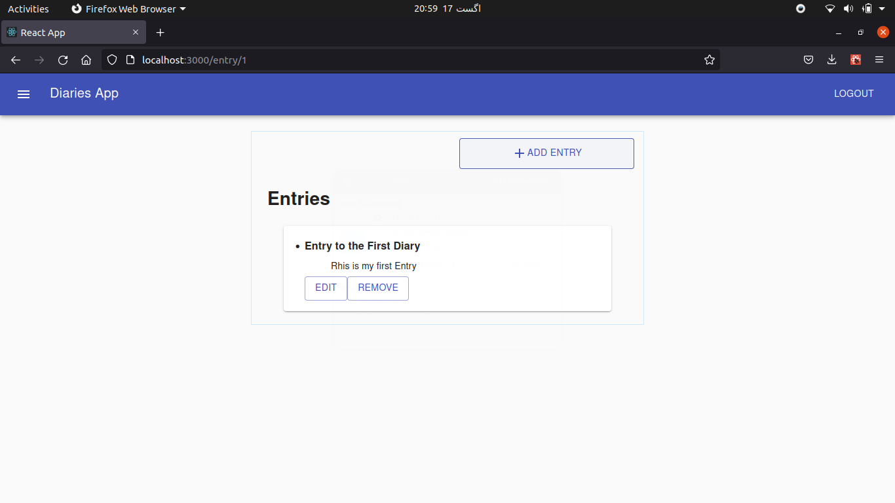

# Full Stack Diaries App

This is a Full stack Diaries App with complete user functionalities such as : Login , Signup , Create,Read,Update,Delete diaries as well as Entries

## Available Scripts

In the main folder run
### `yarn start` OR ### `npm start`
Runs the app in the development mode.\
Open [http://localhost:3000](http://localhost:3000) to view it in the browser.

to run the front end of the project .
Create a mySql batabase as (' diaryApp ')
For the Backend go into the Server/src and create a file config.json in the Config Folder 
place all of the information in the config folder as 

Then , in the Server folder 
### `npm start`  to run the server

Runs the Server in the development mode.\
Open [http://localhost:8080] to view it in the browser.

The App will look like

Mobile view

